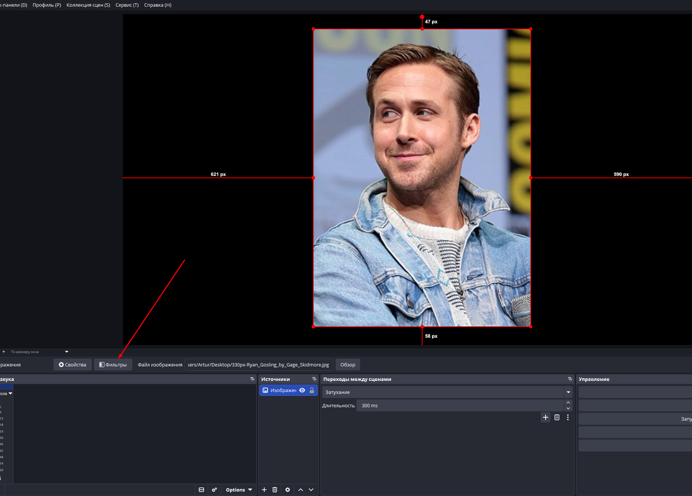
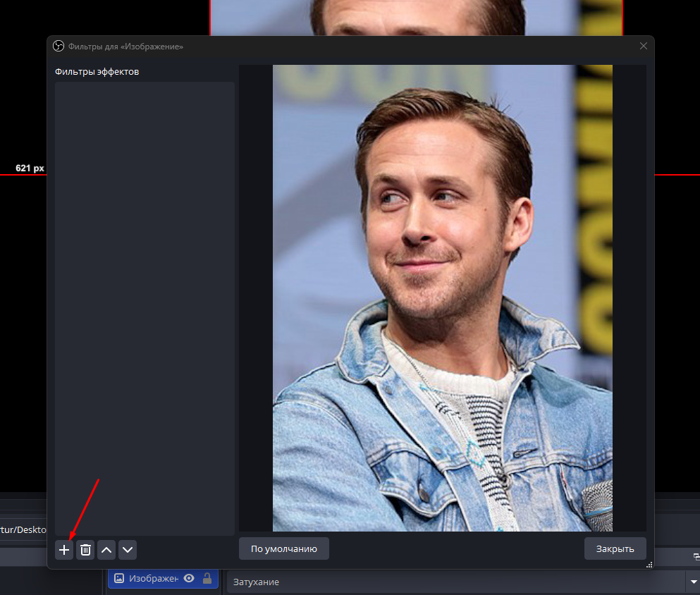
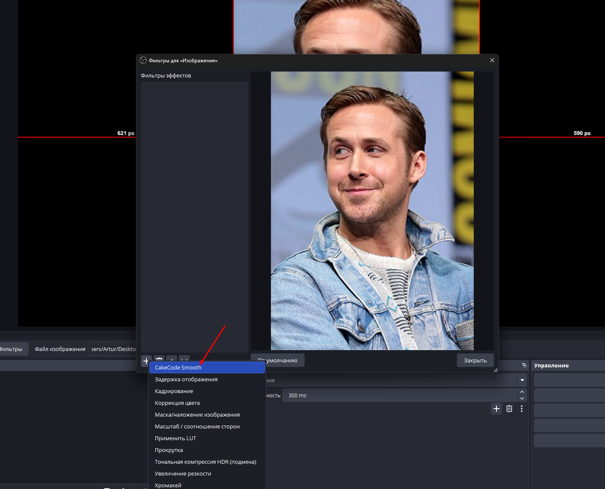
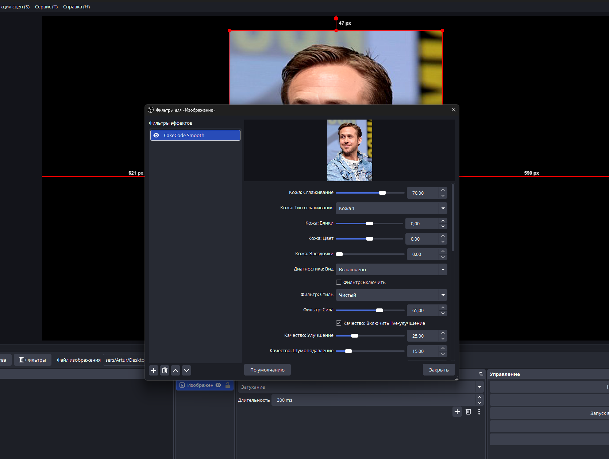

# CakeCode Smooth для OBS Studio

**CakeCode Smooth** - плагин-фильтр для OBS Studio, который добавляет live beauty-обработку для камеры, видео и изображений.

Плагин подходит для стримов, записи видео, live-контента, вебкамеры и медиа-источников в OBS.

## Теги и ключевые слова

OBS, OBS Studio, OBS plugin, OBS filter, OBS effect filter, OBS beauty plugin, OBS camera filter, OBS webcam filter, streaming, live streaming, webcam, video filter, beauty filter, skin smoothing, face smoothing, smooth skin, Color Key, Chroma Key, green screen, sparkle effect, highlight sparkles, live beauty, CakeCode, CakeCode Smooth.

По-русски: плагин для OBS, фильтр для OBS, OBS Studio плагин, сглаживание кожи, улучшение вебкамеры, фильтр камеры, фильтр для стрима, Color Key, Chroma Key, зеленый экран, beauty-фильтр, бьюти фильтр, sparkle-блики, блики, обработка лица, live beauty.

## Скачать

Скачайте установщик из этого репозитория:

**CakeCode.Smooth.Installer.exe**

Или откройте последнюю версию в разделе Releases:

https://github.com/Wizzyart/cakecode-smooth-obs/releases/latest

## Установка

1. Закройте OBS Studio.
2. Запустите `CakeCode.Smooth.Installer.exe` от имени администратора.
3. Дождитесь сообщения об успешной установке.
4. Откройте OBS Studio.
5. Нажмите правой кнопкой по источнику камеры, видео или изображения.
6. Откройте **Фильтры**.
7. Добавьте **Фильтр эффекта**.
8. Выберите **CakeCode Smooth**.

## Как добавить фильтр в OBS

### 1. Откройте фильтры источника

Нажмите правой кнопкой мыши по камере, видео или изображению и выберите **Фильтры**.



### 2. Добавьте фильтр эффекта

В окне фильтров нажмите кнопку добавления и выберите **Фильтр эффекта**.



### 3. Выберите CakeCode Smooth

В списке фильтров выберите **CakeCode Smooth**.



### 4. Настройте параметры

После добавления откроются настройки сглаживания кожи, фильтров, Color Key и sparkle-бликов.



## Что делает плагин

CakeCode Smooth работает как нативный OBS effect filter. Он обрабатывает изображение прямо внутри OBS и добавляет набор beauty-инструментов без необходимости использовать отдельные программы.

## Основные функции

### Сглаживание кожи

Плагин добавляет мягкое сглаживание кожи для live-видео.

Доступны несколько вариантов сглаживания:

- **Кожа 1** - мягкое базовое сглаживание.
- **Кожа 2** - более выраженное high-pass smoothing сглаживание.
- **Кожа 3** - альтернативный режим для более плотной beauty-обработки.

Главный параметр:

- **Кожа: Сглаживание** - регулирует силу эффекта.

### Beauty-настройки

Плагин содержит дополнительные настройки для улучшения внешнего вида изображения:

- **Кожа: Блики** - добавляет мягкое сияние в светлых областях.
- **Кожа: Цвет** - помогает сделать тон кожи приятнее.
- **Кожа: Звездочки** - добавляет мягкие sparkle-блики на ярких участках.

### Фильтры цвета

Внутри есть набор готовых цветовых стилей:

- Чистый
- Теплая кожа
- Мягкий гламур
- Бронза
- Холодный fashion
- Кино
- Матовый
- Жемчуг
- Медовый
- Розовый glam
- Черно-белый luxe
- Teal & Orange
- Чистый HD
- Мечта
- Золотой час
- Фарфор
- Ночной люкс

Параметры:

- **Фильтр: Включить** - включает или выключает цветовой стиль.
- **Фильтр: Стиль** - выбирает нужный preset.
- **Фильтр: Сила** - регулирует интенсивность выбранного стиля.

### Улучшение изображения

Плагин добавляет live enhancement для более приятной картинки:

- улучшение контраста;
- корректировка яркости;
- настройка гаммы;
- работа с насыщенностью;
- мягкое усиление деталей.

### Color Key

В плагин встроен Color Key, похожий по логике на OBS Color Key v2.

Он нужен, чтобы удалять выбранный цвет из изображения, например зеленый фон.

Настройки Color Key:

- **Включить Color Key** - включает удаление выбранного цвета.
- **Тип цвета** - выбор стандартного ключевого цвета.
- **Цвет** - ручной выбор цвета для удаления.
- **Сходство** - насколько близкие цвета будут удаляться.
- **Гладкость** - мягкость края после удаления цвета.
- **Непрозрачность** - прозрачность результата.
- **Контрастность** - корректировка после keying.
- **Яркость** - корректировка яркости после keying.
- **Гамма** - корректировка gamma после keying.

По умолчанию Color Key выключен, чтобы не менять изображение без необходимости.

### Sparkle-блики

Функция **Кожа: Звездочки** добавляет мягкие световые блики не случайной сеткой, а по ярким участкам изображения.

Это лучше подходит для:

- украшений;
- светлых бликов на коже;
- отражений;
- ярких деталей в кадре;
- beauty/live эффекта.

### Локализация

Плагин содержит интерфейс на двух языках:

- русский;
- английский.

## Что внутри установщика

Установщик включает всё необходимое для работы:

- OBS plugin DLL;
- shader-файл;
- русскую и английскую локализацию;
- runtime-библиотеки;
- AI model file для будущей segmentation-функции.

Пользователю не нужно скачивать отдельные `.dll` или `.onnx` файлы вручную.

## Важные замечания

- Требуется Windows и OBS Studio 64-bit.
- Перед установкой OBS Studio должен быть закрыт.
- Установщик требует права администратора, потому что устанавливает плагин в папку OBS.
- Установщик пока не подписан цифровой подписью, поэтому Windows SmartScreen может показать предупреждение.

## Поддержать разработку

Если плагин оказался полезным, можно поддержать дальнейшую разработку.

```text
USDT TRC20: TSHxLUkcRQno3hJQ1DAcx2UPEbjEMJsSUh
USDT ERC20: 0xcef2832570ebee0395b055127ca14b069916c70d
BTC:        1GdFQj3PZEJvPY6zHXT8j8brnB59bHHVs7
```

## Автор

Wizzyart
